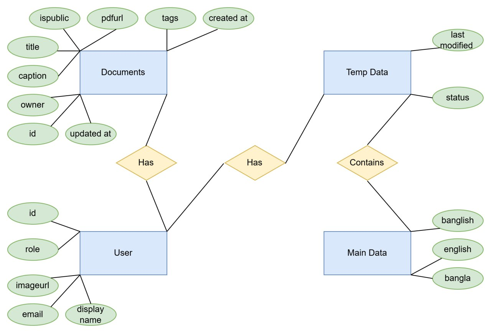

# 🌏 Banglish to Bangla Conversion App

A comprehensive tool to bridge the gap between Banglish (Bangla written in English) and authentic Bangla, offering advanced translation, chatbot interaction, content creation, and language learning features.

## Project Demonstration
https://youtu.be/enjSW7mZueA

## Live Application
https://banglish-to-bangla-conversion-app-rh41.vercel.app/
## 🌟 Features

### Core Features

1. **Banglish to Bangla Conversion**
   - Seamless and accurate translation of Banglish to Bangla

2. **Chatbot Integration**
   - Chatbot understands queries in both Banglish and Bangla, responding in Bangla

3. **Text Editor**
   - Create and convert Banglish text into Bangla seamlessly

4. **PDF Export**
   - Save stories or content as PDFs with public or private sharing options

5. **Content Caption Generation**
   - Auto-generate titles and captions for PDFs

6. **Search Functionality**
   - Search for PDFs or profiles using Banglish or Bangla

7. **Continuous Learning**
   - User contributions improve translation accuracy over time

### Bonus Features

- **Voice Interaction**: Input text or interact with the chatbot hands-free
- **Smart Editor**: Auto-correction for Banglish typing errors
- **Real-Time Collaboration**: Collaborate with others on writing or translating content
- **Analytics Dashboard**: Insights on user activity, translations, and interactions
- **Customizable Fonts**: Choose different Bangla fonts for PDFs

## 🛠️ Technology Stack

- **Frontend**: ReactJS
- **Backend**: Node.js (Express JS)
- **Database**: MongoDB
- **Translation System**: LLM-based models (e.g., Gemini API)
- **Hosting**: Vercel

## 🚀 How to Run Locally

1. Clone the repository:
   ```bash
   git clone https://github.com/Sabbir-Asif/Banglish_to_Bangla_Conversion_App.git
   cd Banglish_to_Bangla_Conversion_App
   ```

2. Install dependencies:
   ```bash
   cd frontend
   npm i
   cd backend
   npm i
   ```

3. Run backend server:
   ```bash
   cd backend
   npm run dev
   ```

4. Run frontend server:
   ```bash
   cd frontend
   npm run dev
   ```

## 🎯 Goals of the Project

- Enhance communication and content creation in authentic Bangla
- Simplify the learning of Bangla expressions
- Bridge cultural and linguistic gaps through technology

## 📊 System Diagrams

### Database Schema


### System Workflows


## 📸 Application Screenshots

### Home Page


### AI Assistant


### Translation Interface


### Content Creation


### Smart Correction


## 🤝 Contributing

1. Fork the repository
2. Create a new branch: `git checkout -b feature-name`
3. Commit your changes: `git commit -m "Add some feature"`
4. Push to the branch: `git push origin feature-name`
5. Submit a pull request

---
